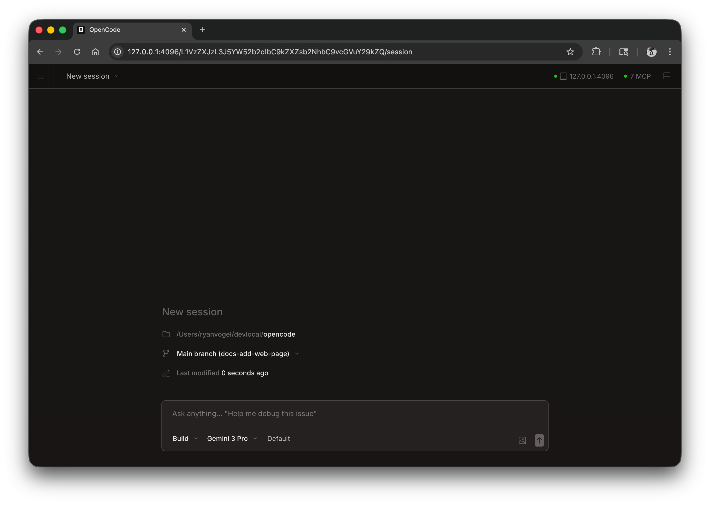
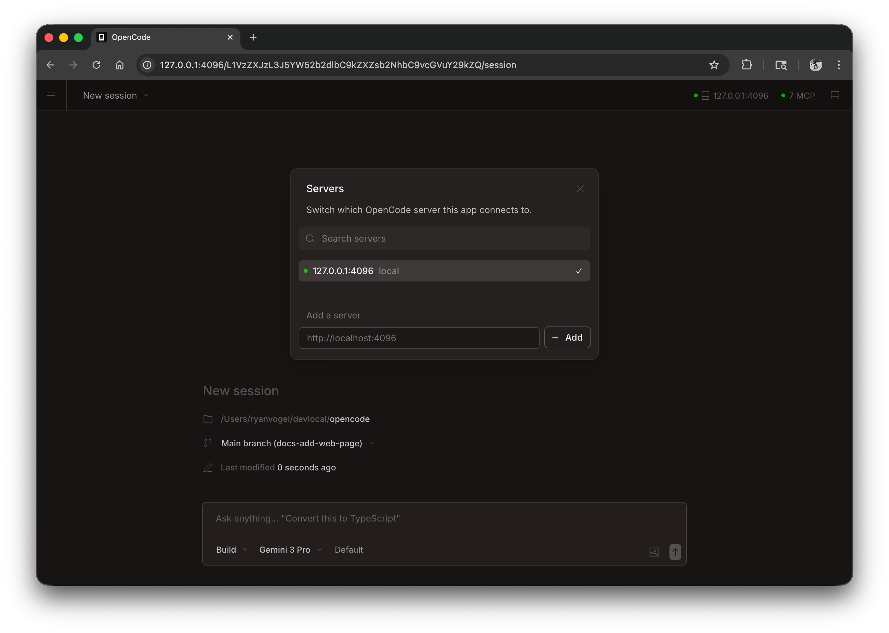

يمكن تشغيل AWMate كتطبيق ويب داخل متصفحك، ليمنحك تجربة البرمجة القوية بالذكاء الاصطناعي نفسها دون الحاجة إلى terminal.



## البدء

ابدأ تشغيل واجهة الويب عبر تنفيذ:

```bash
awmate web
```

يؤدي ذلك إلى تشغيل خادم محلي على `127.0.0.1` بمنفذ عشوائي متاح، ويفتح AWMate تلقائيا في المتصفح الافتراضي لديك.

:::caution
إذا لم يتم تعيين `AWMATE_SERVER_PASSWORD` فسيكون الخادم دون حماية. هذا مناسب للاستخدام المحلي، لكنه يجب أن يكون مُعينا عند إتاحة الوصول عبر الشبكة.
:::

:::tip[مستخدمو Windows]
لأفضل تجربة، شغّل `awmate web` من [WSL](/docs/windows-wsl) بدلا من PowerShell. يضمن ذلك وصولا صحيحا إلى نظام الملفات وتكاملا أفضل مع terminal.
:::

---

## الإعدادات

يمكنك ضبط خادم الويب باستخدام خيارات CLI أو عبر [ملف الإعدادات](/docs/config).

### المنفذ

افتراضيا، يختار AWMate منفذا متاحا. يمكنك تحديد منفذ:

```bash
awmate web --port 4096
```

### اسم المضيف

افتراضيا، يرتبط الخادم بـ `127.0.0.1` (للاستخدام المحلي فقط). لجعل AWMate متاحا على شبكتك:

```bash
awmate web --hostname 0.0.0.0
```

عند استخدام `0.0.0.0` سيعرض AWMate كلا من عناوين الوصول المحلي وعناوين الشبكة:

```
  Local access:       http://localhost:4096
  Network access:     http://192.168.1.100:4096
```

### اكتشاف mDNS

فعّل mDNS لجعل خادمك قابلا للاكتشاف على الشبكة المحلية:

```bash
awmate web --mdns
```

يضبط ذلك تلقائيا اسم المضيف إلى `0.0.0.0` ويعلن عن الخادم باسم `awmate.local`.

يمكنك تخصيص اسم نطاق mDNS لتشغيل عدة نسخ على الشبكة نفسها:

```bash
awmate web --mdns --mdns-domain myproject.local
```

### CORS

للسماح بنطاقات إضافية عبر CORS (مفيد للواجهات الأمامية المخصصة):

```bash
awmate web --cors https://example.com
```

### المصادقة

لحماية الوصول، عيّن كلمة مرور عبر متغير البيئة `AWMATE_SERVER_PASSWORD`:

```bash
AWMATE_SERVER_PASSWORD=secret awmate web
```

اسم المستخدم الافتراضي هو `awmate`، ويمكن تغييره عبر `AWMATE_SERVER_USERNAME`.

---

## استخدام واجهة الويب

بعد التشغيل، تتيح لك واجهة الويب الوصول إلى جلسات AWMate الخاصة بك.

### الجلسات

اعرض جلساتك وأدرها من الصفحة الرئيسية. يمكنك رؤية الجلسات النشطة وبدء جلسات جديدة.


### حالة الخادم

انقر على "See Servers" لعرض الخوادم المتصلة وحالتها.



---

## إرفاق terminal

يمكنك إرفاق واجهة terminal (TUI) بخادم ويب قيد التشغيل:

```bash
# ابدأ خادم الويب
awmate web --port 4096

# في محطة طرفية أخرى، اربط TUI
awmate attach http://localhost:4096
```

يتيح لك ذلك استخدام واجهة الويب وterminal في الوقت نفسه، مع مشاركة الجلسات والحالة نفسها.

---

## ملف الإعدادات

يمكنك أيضا ضبط إعدادات الخادم داخل ملف الإعدادات `awmate.json`:

```json
{
  "server": {
    "port": 4096,
    "hostname": "0.0.0.0",
    "mdns": true,
    "cors": ["https://example.com"]
  }
}
```

تكون خيارات CLI ذات أولوية أعلى من إعدادات ملف الإعدادات.
